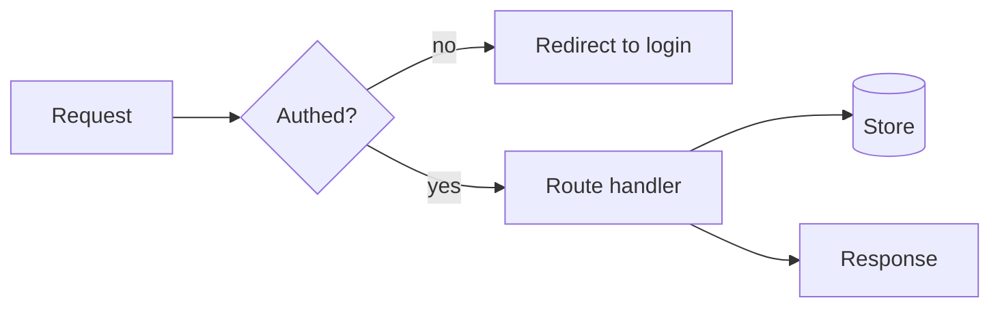

# Agent Instructions

## Autonomy Rules

- Never ask the user any questions.
- Work autonomously from the available repository context, docs, tests, and issue text.
- If information is missing, choose the safest reasonable assumption, continue work, and document the assumption in the final summary.
- If blocked by credentials, unavailable external systems, or conflicting requirements, create or update a tracked issue/backlog note with the blocker and continue with the best local fallback.

## Workflow Rules

1. **Troubleshooting First**
   - Always check `docs/troubleshooting/open/` for open cases.
   - If a case exists, prioritize it.
   - When finished, document verification and move the file to `docs/troubleshooting/closed/`.

2. **Backlog Second**
   - If no troubleshooting case is open, check `docs/backlog/open/`.
   - Work on the highest-value backlog item.
   - Move completed items to `docs/backlog/closed/`.

3. **Requirements Check**
   - If no backlog item is open, check `docs/requirements.md`.
   - If a requirement is unsatisfied, open a new backlog item in `docs/backlog/open/`.
   - Keep backlog progress updated while implementing.

4. **New Requirement Invention**
   - If no requirements or backlog items are open, propose a simple high-value requirement for the SpotiFLAC web UI.
   - Start implementation and create/maintain an open backlog item during the work.

5. **Testing**
   - New features must include unit tests and Playwright tests where applicable.
   - Keep features testable by AI systems.

6. **Deployment & CI**
   - The product must be distributed as a single container image.
   - CI must run quality checks and publish the container.

7. **Documentation**
   - Keep `README.md` and relevant docs updated.

8. **Issue Encountered**
   - If an issue blocks progress, stop feature work.
   - Do quick research.
   - Create a GitHub issue for the blocker.
   - Continue original work after issue creation.

## Agents Md

Every `AGENTS.md` MUST include a tree of the directories below it, each with a short `#` comment. Annotate the root, then descend as deep as needed. Stop at any sub-directory that has its own `AGENTS.md`; that file documents its own subtree. Keep each comment to a few words.

```text
app/                # Next.js app
├── components/     # reusable UI
│   ├── icons/      # svg assets
│   └── forms/      # form widgets
├── lib/            # data and helpers
└── api/            # backend routes
```
Each directory with an `AGENTS.md` MUST also hold a `CLAUDE.md` symlink to it. Run `ln -s AGENTS.md CLAUDE.md`. Both agents and Claude Code then read one file. Commit the link, never a copy.
Keep each `AGENTS.md` under 250 lines. When it grows past 250, move directory-specific detail into a nested `AGENTS.md` in the right child directory. Leave a short pointer behind. Depth follows the tree, not one big file.
Every `AGENTS.md` MUST include at least one Mermaid diagram. Show what the file tree cannot: control and data flow, build and deploy pipelines, state machines, runtime module interaction. Make the non-obvious clear at a glance. Do not redraw the folder layout. Wrap it in a ```mermaid block so it renders. Keep it current as the behavior changes.


Refresh each `AGENTS.md` once its directory changes by ~1000 LOC since the last update. Treat the doc like code. Stale guidance is a defect.

## Code Quality

Enforce rules automatically wherever possible. Use git hooks for fast checks before a commit or push. Use CI as the backstop on every pull request. If a machine can check a rule, do not rely on people remembering it.
Keep the repository root clean. Files that define a package, build, test, lint, or secret-scanning setup MUST live in a purpose-named package directory instead of the repo root.

Use `app/`, `web/`, or `packages/<name>/` when the files belong to product code. Use `tools/<name>/` when the files only support repository tooling or automation.

This includes files such as `package.json`, `package-lock.json`, `tsconfig.json`, `vite.config.ts`, `vitest.config.ts`, `eslint.config.js`, and `.secretlintrc.json`.
Every language MUST have a linter and an auto-formatter. This includes Markdown. No language is exempt.
No hand-written file may exceed 600 lines. As a file nears the limit, split it by responsibility. Do not pack more into one file. Generated and vendored files are exempt: lock files (`pnpm-lock.yaml`, `package-lock.json`, `yarn.lock`), minified bundles, snapshots, and other machine-generated output.
Limit every hand-written line to 100 characters. Wrap or refactor long lines. Generated and vendored files are exempt. The only in-source exception is unbreakable tokens like URLs or hashes.
Linting MUST be very strict. Enable the strictest available ruleset for every linter, treat all warnings as errors, and do not disable or downgrade rules to make code pass. Fix the underlying issue instead. Inline suppressions are a last resort: each one needs a specific rule code and a comment explaining why. A build with any lint violation MUST fail.

## Git Commits

Each commit must contain one logical change only. Do not mix unrelated changes, refactors with behavior changes, or formatting with functional changes. Each commit must be independently checkable and in working state.
Required Commit Body Sections for non-trivial commits:
- Context: What problem/need triggered this
- Change: High-level summary of what changed
- Rationale: Why this approach, trade-offs, alternatives rejected
- Impact/Risk: Behavior changes, migrations, compatibility, performance
- Tests: Exact command(s) run (e.g., `Tests: cd src && uv run pytest tests/`)
Subject: imperative mood ("add", "fix"), ~50 chars, no period.

Body: blank line after subject, explain what/why (not how), wrap ~72 chars. Body required for non-trivial changes.
Use Conventional Commits format: `type(scope?): subject`

Allowed types: `feat, fix, docs, refactor, test, perf, build, ci, chore, style, revert`

Breaking changes: use `type(scope)!: subject` OR `BREAKING CHANGE: ...` footer with migration steps.
Link issues via footer: `Fixes #123` or `Refs #123`. If no issue exists, body must clearly state the why.
MUST NOT add author/co-author attribution trailers for AI. Forbidden: `Co-authored-by:`, `Generated-by:`, `AI-Generated-by:`, `Assisted-by:`, `Model:`. Allowed trailers: `Fixes #...`, `Refs #...`, `BREAKING CHANGE:...`, `Signed-off-by:` (human only).

## Git Workflow

Commit in small increments, but no meaningless micro-commits. "WIP"/vague messages forbidden. Checkpoints must stay local or on a scratch branch until green and reviewable. Rebase/squash before PR/merge.
MUST run tests before every commit (minimum: fast suite or targeted tests for changed area). EACH COMMIT MUST KEEP REPO GREEN: build passes, tests pass. Failing commits are forbidden on shared branches. Intermediate failing steps must stay local and be squashed before PR/merge.
Store shared Git hooks in tracked `.githooks/`, not private `.git/hooks`.
Configure each checkout with `git config core.hooksPath .githooks/hooks`.
Hook entrypoints in `.githooks/hooks/<hook>` MUST be tiny wrappers only:
run every executable script in matching `.githooks/<hook>/` dir in sorted order,
forward hook args, and stop on first failure.
Put real checks in numbered scripts like `10-lint.sh`, `20-test.sh`, `30-build.sh`.
Keep hook scripts executable and POSIX `sh` unless project needs otherwise.
Use pre-commit for fast staged or targeted checks.
Use pre-push for slower full checks like test/build.
CI remains final backstop.

## Project Docs

Tasks are tracked as markdown files in `docs/backlog/` with the naming convention `<index>_<task-slug>.md`:

- `docs/backlog/open/` - Open tasks awaiting work
- `docs/backlog/pending-review/` - Completed tasks awaiting review
- `docs/backlog/done/` - Completed and reviewed tasks

Move task files between directories as their status changes.
Use `docs/todo.md` to track work: `- [ ]` open, `- [~]` in progress, `- [x]` done.
ALWAYS keep track of troubleshooting progress in a troubleshooting case file in docs/troubleshooting/<DATE>_<SUBJECT>.md.
While troubleshooting, append the steps taken to the troubleshooting case file. For example, `echo 'pinged 1.1.1.1, ping is ok' >> docs/troubleshooting/<DATE>_<SUBJECT>.md`

## Writing Caveman

Abbreviate common prose words (DB, auth, config, req, res, fn, impl) and strip conjunctions. One word when one word does the job.
Use arrows for causality (X -> Y) instead of spelling out the connective phrasing.
Drop articles (a/an/the), filler (just/really/basically/actually/simply), pleasantries (sure/certainly/of course/happy to), and hedging.
Never abbreviate code symbols, function names, API names, or error strings. Keep those verbatim, even when compressing everything else.
Prefer short synonyms: "big" not "extensive", "fix" not "implement a solution for". Sentence fragments are fine.

## Writing Style

Maximize information density, while making text effortless to read
Never use bold formatting in markdown text, unless the info is absolutely critical
NEVER use emojis anywhere, but rather use [ERROR], [WARNING], [INFO] or something else in brackets
Keep markdown and text headings unnumbered
